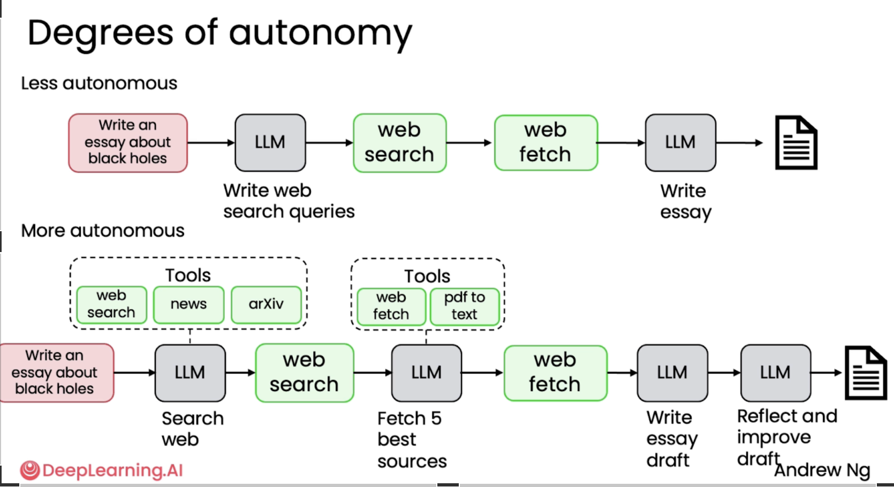
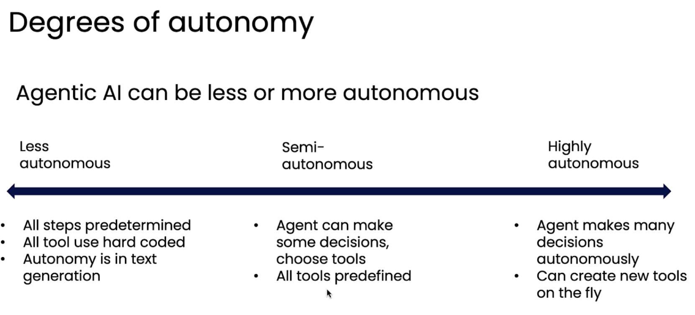
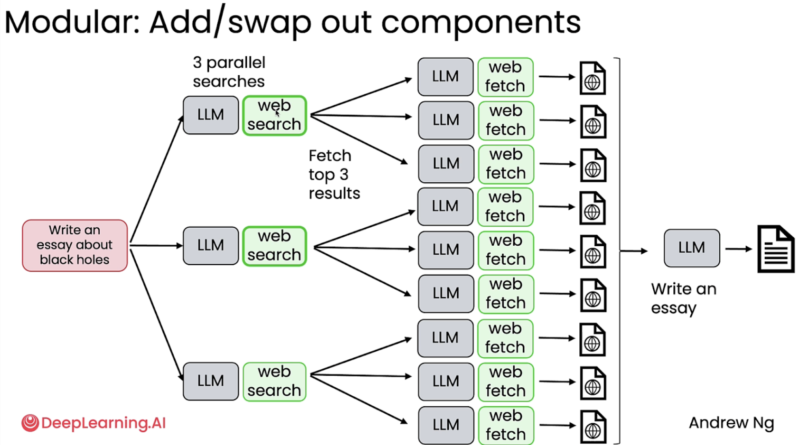
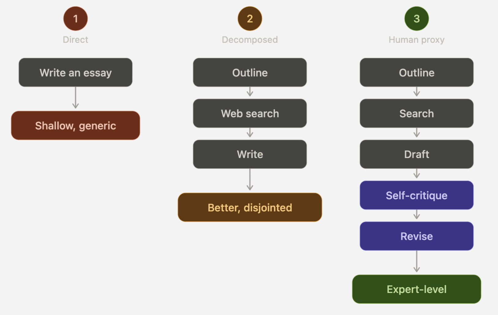
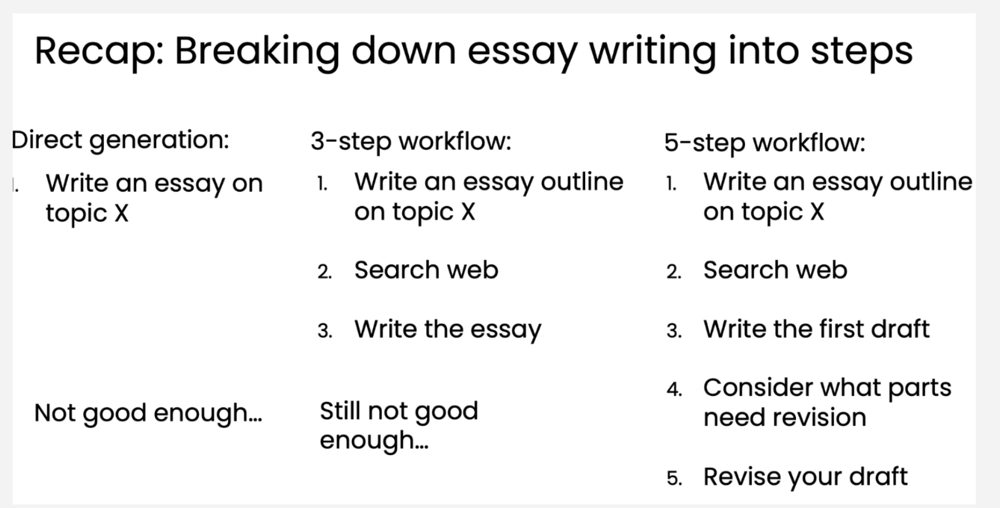
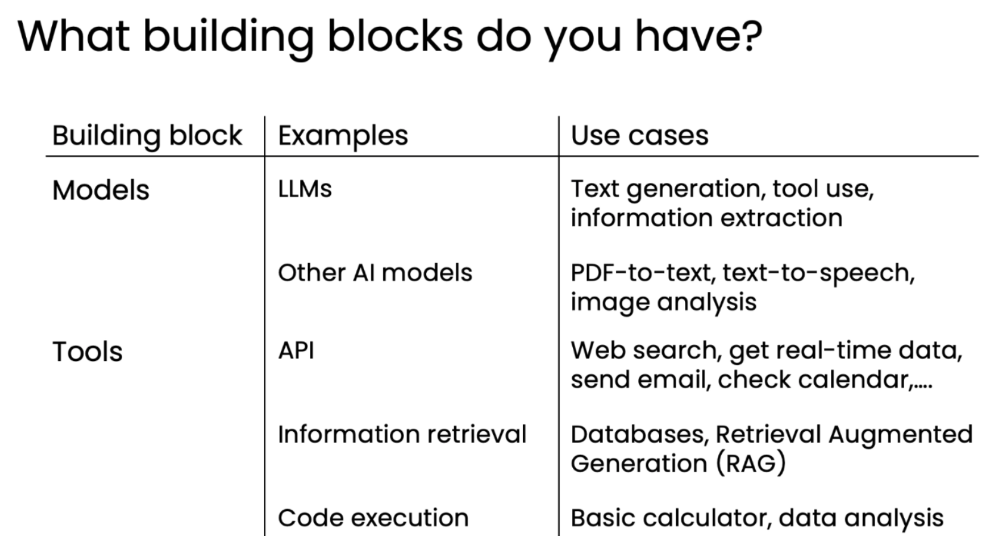

# **What is Agentic IA?**

An agentic AI workflow is a **process** where an **LLMbased app executes** multiple steps to **complete a task.**

Agentic workflows align with [Compound AI systems](https://www.ibm.com/think/topics/compound-ai-systems) that are basically advanced configurations that combine multiple [AI models](https://www.ibm.com/topics/ai-model), techniques or systems to solve complex problems more effectively than a single artificial intelligence (AI) model could. These systems integrate different components, each specialized in a particular task to work collaboratively or sequentially.

## **Degrees of Autonomy.**

Depending on the requirements, AI Workflows can be executed  using various hybrid agentic models.

The level of autonomy in some agents may be li mited.

Example of an agentic workflow for research purposes.

Red: Human interactions

Green: LLM can decide it self what is the best step to follow.

### **The Autonomy Spectrum in Agentic Workflows**

Agentic workflows can be categorized by the degree of autonomy given to the underlying Language Model (LLM). This spectrum ranges from rigidly defined, deterministic processes to highly flexible, self-directed decision-making.

| `Degree` | `Characteristics` | `Example (Essay Writing)` |
| :---- | :---- | :---- |
| **`Less Autonomous`** | `Fully deterministic; sequence of steps is hard-coded by the engineer.` | `User Query — Search  — Fetch — Summarize.` |
| **`Semi-Autonomous`** | `Can make some decisions (like choosing between a few tools), but within a predefined scope.` | `LLM chooses between Google Search or ArXiv based on the topic.` |
| **`Highly Autonomous`** | `The LLM decides the sequence of steps, how many times to loop, and which tools to use/create.` | `LLM searches, reflects on results, decides it needs more data, and repeats.` |

 **Practical Implementation vs. Research**

* **Low Autonomy:** These are the most common in business today. They are controllable, predictable, and reliable, making them ideal for production environments.  
* **High Autonomy:** These are at the frontier of research. They are incredibly powerful but harder to control and more unpredictable.

Key Insight: You don't need "maximum autonomy" for a system to be valuable. Many of the most successful AI applications currently sit on the lower end of the agentic spectrum because they balance AI reasoning with human-defined guardrails.

## **Benefits of Agentic AI.**

**Parallelism (Superhuman Speed)**

Human cognition is fundamentally sequential. If a human needs to research black holes, they have to read website A, then website B, and then website C.

Agentic workflows can run tasks asynchronously:

1. The system generates three different **search queries simultaneously.**  
2. It downloads and **reads** all nine resulting web pages at the **exact same time.**  
3. It synthesizes the data into a final output.

**Why this matters:** Even though an agentic workflow takes longer than a standard "zero-shot" prompt (because it is doing more steps), it is drastically faster than a human doing the equivalent amount of rigorous research and planning.

**Modularity (The "Lego Block" Architecture)**

Non-agentic AI is a black box—you put a prompt in, and you get an answer out. If the answer is bad, you can't fix the internal logic.

Agentic workflows are highly modular. Because a complex task is broken down into atomic steps, you can swap out components on the fly to find the best fit:

* **Swapping Tools:** If Google Search isn't returning good results for a coding query, you can instantly swap the agent's tool to search GitHub or Stack Overflow instead.  
* **Swapping Models:** You don't have to use the same brain for every step. You might use a cheap, fast model (like Llama 3\) to generate search terms, but use a heavy, smart model (like Claude 3.5 Sonnet or GPT-4) to write the final essay.

**Massive Performance Gains (The "Workflow \> Scaling" Concept)**

Historically, the AI industry believed the only way to get better results was to buy a bigger, smarter, and more expensive model. Agentic workflows prove this wrong.

Ng uses the **HumanEval coding benchmark** (a test of how well an AI writes software) to prove this point:

* **GPT-3.5 (Zero-shot):** Scores **40%** (Directly asking it to write the code once).  
* **GPT-4 (Zero-shot):** Scores **67%** (A massive jump representing a generational leap in model size).  
* **GPT-3.5 (Agentic):** When the older, weaker GPT-3.5 is placed inside a workflow (where it is allowed to draft the code, test it, reflect on the errors, and rewrite it), its performance drastically improves, **surpassing the 67% score of GPT-4.**

**Why this matters:** You don't always need to pay for the most expensive "frontier" model. By wrapping a cheaper, faster model in an intelligent workflow, you can achieve state-of-the-art results at a fraction of the cost.

## **Task decomposition: Identifying the steps in a workflow.**

This module covers one of the most critical skills you need as an AI engineer: **Task Decomposition**. It is the art of translating a messy human workflow into a precise, step-by-step recipe that an AI can execute.

---

### **1\. The Core Concept: Task Decomposition**

An LLM left to its own devices will often give you a surface-level, "lazy" output. To get deep, expert-level results, you must break the macro-goal down into micro-tasks.

**The Litmus Test for Every Step:**

As you break a task down, you must look at every single step and ask one binary question:

*"Can this specific step be executed flawlessly by a single LLM prompt, a specific piece of code, or an API call?"*

If the answer is **No**, the step is still too broad and must be decomposed further.

### **2\. The "Human Proxy" Iteration Loop**

The process to building agents are rarely a one-and-done process. When your agent's output is poor (e.g., the essay is disjointed or the code fails), you debug it by asking: *"How would a human expert fix this?"*

**Example: The Essay Writer Evolution**

### **3\. Real-World Task Breakdowns**

Here is how common business tasks map to agentic steps:

| `Application` | `Step 1 (Brain)` | `Step 2 (Tool/Action)` | `Step 3 (Tool/Action)` |
| :---- | :---- | :---- | :---- |
| **Customer Support** | LLM extracts User ID, Order \#, and Intent from email. | Agent triggers API to query the SQL database for order status. | LLM drafts reply; Agent triggers API to send email. |
| **Invoice Processing** | OCR model converts PDF to raw text. | LLM extracts Biller Name, Amount, and Due Date. | Agent triggers Python script to update accounting software. |

---

### **4\. The Agentic Toolbox (Your Building Blocks)**

To successfully decompose tasks, you need to know what "tools" you actually have available to assign to those micro-tasks.

* **The "Brains" (Models):**  
  * **LLMs:** The reasoning engine (text generation, data extraction, routing decisions).  
  * **Multimodal/Specialized Models:** Tools for specific senses (Image analysis, Speech-to-Text, Optical Character Recognition).  
* **The "Hands" (Tools & APIs):**  
  * **Information Retrieval:** Web search (Tavily, Google) or **RAG** (Retrieval-Augmented Generation—searching your own internal private databases).  
  * **Action APIs:** Sending emails, checking calendars, fetching live weather.  
  * **Code Execution:** A secure sandbox where the LLM can write and run Python code to perform complex math, format data, or build charts.

---

## **Evaluating Agentic**

### **1\. The "Build First, Evaluate Later" Mindset**

It is nearly impossible to anticipate every way an AI agent might fail or behave unexpectedly.

* **The Strategy:** Do not spend weeks trying to predict errors. Build a V1 of your workflow, run it, and manually read the outputs to spot weird behaviors (e.g., a customer service agent unexpectedly praising a competitor).  
* Once you spot a recurring error, you build an "Eval" specifically to eliminate it.

### **2\. The Two Types of Evaluation**

Depending on the task, you will need to measure success differently:

* **Objective Evals (Code-Based):** Used for black-and-white rules. If your agent is forbidden from mentioning "RivalCo," you don't need an AI to check this. You write a simple Python script to parse the output text and count how many times the competitor's name appears.  
* **Subjective Evals (LLM-as-a-Judge):** Used for qualitative outputs (like the tone of an email or the depth of an essay). You use a second, separate LLM prompt to read the agent's output and grade it.  
  * *Note:* Ng warns that asking an LLM to simply rate something "on a scale of 1 to 5" is often unreliable. More robust frameworks are required for this to work well.

    ### **3\. End-to-End vs. Component Evals**

As you iterate on your agent, you will need to test it at different levels of granularity:

* **End-to-End Evals:** Measuring the final output of the entire system (Did it solve the customer's problem?).  
* **Component-Level Evals:** Measuring the performance of one specific micro-task (Did the routing LLM correctly identify that this was a billing issue instead of a tech support issue?).

  ### **4\. Error Analysis (Reading the "Traces")**

When an agent fails, you can't just look at the final bad answer. You must perform Error Analysis by reading the **traces**—the logs of the intermediate steps, tool calls, and raw thoughts the LLM had along the way. This allows you to pinpoint exactly which step in your decomposition failed.

---

I can't edit your Google Doc directly — I only have read access to Drive. But here's the section formatted to match your doc's style exactly, ready to paste at the bottom.

---

## **Agentic Design Patterns**

**Core Concept:** Agentic workflows are built by combining building blocks into complex sequences using repeatable design patterns. There are **4 key design patterns.**

---

### **1\. Reflection**

The agent examines its own output and iterates to improve it.

**Flow:** LLM generates output → LLM critiques that output → feedback is fed back → improved version is generated.

* **Example:** LLM writes code → prompted to check correctness/style/efficiency → critique fed back → better code produced.  
* **Enhanced variant:** If you can *run* the code and capture error messages, feeding runtime errors back creates even stronger iteration loops.  
* **Multi-agent variant:** Instead of self-critique, a separate **"critique agent"** (same LLM, different persona prompt) goes back and forth with the generator agent.  
* **Reality check:** Not magic. Doesn't work 100% of the time, but often provides a meaningful performance bump.

---

### **2\. Tool Use**

The agent is given **callable functions (tools)** to extend its capabilities beyond text generation.

| `Tool Category` | `Examples` |
| :---- | :---- |
| **`Information Retrieval`** | `Web search, database queries` |
| **`Code Execution`** | `Write and run code to compute answers` |
| **`Productivity`** | `Email, calendar, file management` |
| **`Media Processing`** | `Image analysis, generation` |

**Key Insight:** The LLM *decides which tools to call*—it is not following a hardcoded script. It selects the right function for the task dynamically.

---

### **3\. Planning**

The agent **autonomously decides** the sequence of steps needed to complete a task.

* **Example (HuggingGPT paper):** Given a complex image+text request, the model decomposes it into: pose detection → image generation → text generation → text-to-speech.  
* **Key distinction from Tool Use:** In Tool Use, the developer defines *when* tools are called. In Planning, the *LLM itself* decides the order and number of steps.  
* **Trade-off:** Harder to control and more experimental, but can produce powerful results.

---

### **4\. Multi-Agent Collaboration**

Multiple **specialized agents** work together like a team on a complex project.

| `Example` | `Agents Involved` | `Task` |
| :---- | :---- | :---- |
| **`ChatDev`** | `CEO, Programmer, Tester, Designer` | `Collaborative software development` |
| **`Marketing Brochure`** | `Researcher → Marketer → Editor` | `Sequential content creation pipeline` |

* **Trade-off:** Less predictable since you can't always anticipate agent behavior, but research shows better outcomes on complex tasks (biographies, chess moves, software).

---

### **Design Patterns: Key Takeaway**

The engineering challenge is: **find the right building blocks → combine them via these patterns → build evals to measure and iterate.** You don't hardcode everything—you design the structure and let the LLM handle the reasoning within it.

---

[image1]: assets/image1.png

[image2]: assets/image2.png

[image3]: assets/image3.png

[image4]: assets/image4.png

[image5]: assets/image5.png

[image6]: assets/image6.png
